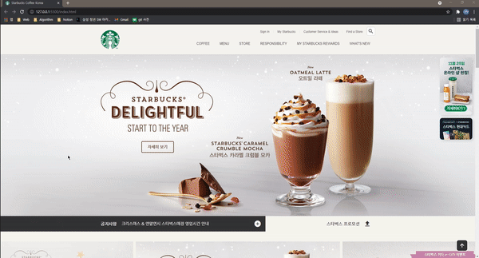

   
  
   
  <h1>스타벅스 웹 사이트 (Starbucks Website)</h1>
   

## 목차

1. [**웹 서비스 소개**]
2. [**기술 스택**]
3. [**사용 라이브러**]
4. [**주요 페이지**]

  

##  1. 웹 서비스 소개

스타벅스 웹 페이지 클론 코딩

  

## 2. 기술 스택

-  
-  
-  

  

## 3.  라이브러리

-  
-  
-  
-  

  

## 4. 주요 페이지

|                메인 페이지                 |
| :----------------------------------------: |
|  |
