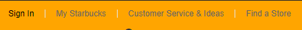
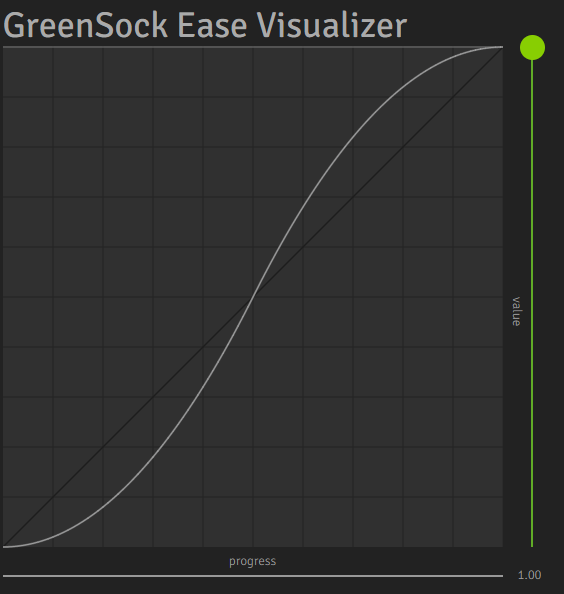
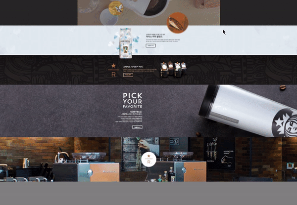

# starbucks-app

> 스타벅스 웹 페이지를 만들면서 배우게 된 것들을 정리해 놓은 문서 입니다.
>
> 강의별 챕터에 따라 나뉘어 있습니다.

---

# 목차

1. [**시작하기**](#1-시작하기)
2. [**Header & Dropdown menu**](#2-Header-&-Dropdown-menu)
3. [**순차적 애니메이션**](#3-순차적-애니메이션)
4. [**요소 슬라이드**](#4-요소-슬라이드)
5. [**유튜브 영상 배경**](#5-유튜브-영상-배경)
6. [**고정 이미지 배경**](#6-고정-이미지-배경)
7. [**3D 애니메이션**](#7-3D-애니메이션)
8. [**푸터**](#8-푸터)
9. [**로그인 페이지**](#9-로그인-페이지)


----

## 1. 시작하기

> ### 1.1 파비콘
>
> ```html
> <link rel="icon" href="./favicon.png">
> ```
>
> - 파비콘은 기본적으로 루트폴더에서 찾아서 적용하게 되어 있다. 하지만 해상도가 떨어져서 다른 파일을 이요하고 싶다면 위와 같이 적용시켜야 한다.
>
> 
>
> ### 1.2 오픈 그래프
>
> 
>
> - 웹페이지가 **소셜 미디어(페이스북 등)**로 공유될 때 우선적으로 활용되는 정보를 지정
>
> > #### 1.2.1 오픈 그래프의 기본 정보
> >
> > - `og:type`: 페이지의 유형(E.g, `website`, `video.movie`)
> > - `og:site_name`: 속한 사이트의 이름
> > - `og:title`: 페이지의 이름(제목)
> > - `og:description`: 페이지의 간단한 설명 - **최대한 가결하게 작성**
> > - `og:image`: 페이지의 대표 이미지 주소(URL)
> > - `og:url`: 페이지 주소(URL)
>
>  
>
> ### 1.3 트위터 카드
>
> - 웹페이지가 **소셜 미디어(트위터)**로 공유될 때 우선적으로 활용되는 정보를 지정합니다.
>
> > #### 1.3.1 트위터 카드의 기본 정보
> >
> > - `twitter:card`: 페이지(카드)의 유형(E.g. `summary`, `player`)
> > - `twitter:site`: 속한 사이트의 이름
> > - `twitter:title`: 페이지의 이름(제목)
> > - `twitter:description`: 페이지의 간단한 설명
> > - `twitter:image`: 페이지의 대표 이미지 주소(URL)
> > - `twitter:url`: 페이지 주소(URL)
>
> **오픈 그래프와 트위터 카드 모두 작성해주는 것이 좋다**
>
>  
>
> ### 1.4 SEO
>
> - Search Engine Optimization
> - 검색 엔진에서 활용할 이미지
>
>  
>
> ### 1.5 Font
>
> - 용량이 크기 때문에 남발하지 않는 것이 좋다.
> - 서로 다른 브라우저에서도 서비스하기 위해 폰트를 지정
> - 라이센스 확인은 필수

---

## 2. Header & Dropdown menu

> - 도메인 주소는 생략이 가능하다
>
> ```html
> <a href="/">
> ```
>
> - 완전히 검은 글자색은 디자인적으로 촌스러울 수 있다.
> - "inner" 라는 ``division``을 만들어서 ``header``.``body`` 등과 같은 구역 내에 사용할 공간을 확보한다. inner에는 특별한 의미는 없다.
>
> ```css
> header .inner {
>   width: 1100px;
>   margin: 0 auto;
> }
> ```
>
> - ``inline``요소는 baseline 아래로 내려오는 경우를 대비해서 아래 쪽에 약간의 공간이 있다. ``inline``요소를 ``block``요소로 만들어 줆으로써 해결할 수 있다.
> - ``ul``태그와 ``li``태그는 단독으로 존재할 수 없다.
> - ``<a href="javascript:void(0)"></a>`` , ``#``은 해시라는 기능이 있기 때문에 ``void``를 더 권장
> - 자주 사용하는 클래스와 태그가 있기 때문에 하위 선택자를 명시할 땐 상위 선택자를 모두 명시해 주는 것이 좋다. (SCSS를 배우면 해결할 수 있다.)
>
> ```css
> header .sub-menu {}
> header .sub-menu ul.menu{}
> header .sub-menu ul.menu li{}
> header .sub-menu ul.menu li a{}
> ```
>
> - 중간중간에 일시적으로 특정 요소의 배경을 눈에 띄는 색으로 바꾸면 제작에 도움이 된다.
> - 요소 위치를 정할 때 ``flex``로만 하는 버릇이 있었는데, ``position``을 더 자주 사용했다. ``absolute``속성을 잘 사용하면 요소의 위치를 정하기가 훨씬 수월하다. 또한 불필요한 ``div``를 줄일 수 있다.
>
> 
>
> ### 2.1 position & margin 속성을 이용한 가운데 정렬
>
> ```css
>   height: 75px;				//정렬하고자 하는 요소의 높이를 지정해주어야 브라우저 계산할 수 있다.
>   position: absolute;
>   top: 0;					// 양 끝의 기준을 정해주어야 한다.
>   bottom: 0;				//
>   margin: auto;				//브라우저가 마진을 자동으로 계산
> ```
>
> 
>
> ### 2.2 메뉴의 클릭 영역 넓히기
>
> - 사용자 편의성을 위해서 필요한 부분
> - 글씨를 작게 만들어서 클릭하기 쉽도록 하기 위함
>
> ```css
> header .sub-menu ul.menu li a {
>   display: block;
>   font-size: 12px;
>   padding: 11px 16px;
>   color: #656565;
> }
> ```
>
> - ``inline``요소에 페이딩을 적용하기 위해서 ``block``요소로 만들어야 한다
> - ``overflow``속성을 조절해서 부모요소 밖으로 나오는 부분을 가릴 수 있다.
>
> 
>
> ### 2.3 구분선 만들기
>
> ```css
> header .sub-menu ul.menu li {
>   position: relative;
> }
> 
> header .sub-menu ul.menu li::before {
>   content: "";
>   display: block;
>   width: 1px;
>   height: 12px;
>   background-color: black;
>   position: absolute;
>   top: 0;
>   bottom: 0;
>   margin: auto 0;
> }
> ```
>
> 
>
> - ``li``요소 중간중간에 구분선이 있는 게 아니라 ``absolute``를 이용해서 위에 띄워놓은 형태이다. 겹쳐져 있는 상태라고 볼 수 있다.
> - ``position``이 ``absolute``이거나 ``fixed``일 경우 가로범위가 최소한으로 자동 축소된다.
>
>  
>
> ### 2.4 BEM(Block Element Modifier)
>
> - ``요소__일부분`` : 요소의 일부분을 표시
> - ``요소--상태`` : 요소의 상태를 표시
>
> ### 2.5 lodash.js
>
> - 이벤트 발생 시 함수가 너무 많이 실행될 때 사용
> - [lodash.js](https://cdnjs.com/libraries/lodash.js)
>
> ```js
> window.addEventListener('scroll', _.throttle(function () {
> }, 300))
> ```
>
> - 이번 app을 제작할 때 쓰인 부분으로 스크롤 이동 이벤트 때 사용했다. 뒤에 숫자는 ms에 해당하는 인자로 해당 시간이 지난 뒤에 함수를 실행한다는 의미.
>
> ### 2.6 gsap
>
> - 애니메이션을 부드럽게 해주는 오픈소스 라이브러리
>
> ```js
> // gsap.to(요소, 지속시간, 옵션)
> gsap.to(badgeEl, .6, {
> opacity: 0
> })
> ```

---

## 3. 순차적 애니메이션

> - 이미지의 대체 텍스트에 적을 내용이 마땅치 않으면 이미지에 있는 글씨를 적는 것도 좋은 방법이다.
>
>  
>
> ### 3.1 순차적 애니메이션 적용
>
> ```js
> const fadeEls = document.querySelectorAll('.visual .fade-in');
> fadeEls.forEach(function (fadeEl, index) {
>   gsap.to(fadeEl, 1,{
>     delay: (index + 0.5) * .7,
>     opacity: 1,
>   });
> });
> ```
>
> - ``delay``는 ``gsap``에서 제공하는 속성

---

## 4.요소 슬라이드

> - ``flex``에서 ``width``는 최대한 줄어드는 성질이 있다. ``flex-grow``속성을 이용하면 원하는대로 설정할 수 있다.
>
>  
>
> ### 4.1 calc()
>
> - css에서는 아래처럼 요소의 수치를 계산할 수 있는 함수를 제공한다.
>
> ```css
> width: calc(819px * 3 + 20px);
> ```
>
> - 요소의 수치를 정확하게 알 수 없을 때 사용하면 더욱 효과적이다.
>
> ```css
> width: calc(100% + 20px);
> ```
>
> ### 4.2 컨텐츠 항상 가운데 출력하기
>
> ```css
> .notice .promotion .swiper-container {
>   width: calc(819px * 3 + 20px);
>   /* height: 553px;
>   background-color: orange;
>   text-align: center;
>   font-size: 200px;
>   position: absolute;
>   top: 40px; */
>   left: 50%;
>   margin-left: -1238.5px; /* 가로 너비 절반 */
> }
> ```
>
> - 위치 상으로 왼쪽으로 **전체 너비의 절반만큼 **이동시킨 뒤, ``margin``을 이용해서 **다시 이동한 만큼의 절반만큼 반대방향**으로 이동시킨다.

---

## 5. 유튜브 영상 배경

> ### 5.1 가로 세로 비율 유지하기
>
> ```css
> .container {
> 	width: 500px;
> 	background-color: royalblue;
> }
> 
> .container .item{
> 	width: 100%;
> 	height: 0;
> 	padding-top: 50%;
> }
> ```
>
> - ``padding-top``의 값을 50%로 하면 부모요소의 가로 너비의 50%만큼을 유지한다.
> - 56.25%는 보편적인 영상 크기인 16:9 비율이다.
>
> ### 5.2 유튜브 영상 출력하기
>
> ```
> // Youtube IFrame API를 비동기로 로드합니다.
> var tag = document.createElement('script');
> tag.src = "https://www.youtube.com/iframe_api";
> var firstScriptTag = document.getElementsByTagName('script')[0];
> firstScriptTag.parentNode.insertBefore(tag, firstScriptTag);
> 
> function onYouTubePlayerAPIReady() {
>   // <div id="player"></div>
>   new YT.Player('player', {
>     videoId: 'An6LvWQuj_8', // 재생할 유튜브 영상 ID
>     playerVars: {
>       autoplay: true, // 자동 재생 유무
>       loop: true, // 반복 재생 유무
>       playlist: 'An6LvWQuj_8' // 반복 재생할 유튜브 영상 ID 목록
>     },
>     events: {
>       // 영상이 준비되었을 때,
>       onReady: function (event) {
>         event.target.mute(); // 음소거!
>       }
>     }
>   });
> }
> ```
>
> - ``onYouTubePlayerAPIReady`` 함수 이름은 Youtube IFrame Player API에서 사용하는 함수이기 때문에 변경하면 안된다. 
> - [더 많은 옵션](https://developers.google.com/youtube/player_parameters.html?playerVersion=HTML5&hl=ko#Parameters)
>
>  ### 5.3 Easing
>
> 
>
> - 애니메이션이 처리되는 속도나 형태를 조절하는 개념.
> - [참고](https://greensock.com/docs/v2/Easing)

---

## 6. 고정 이미지 배경

> 
>
> ```css
> background-attachment: fixed;
> ```

---

## 7. 3D 애니메이션

>- **JS를 이용할 줄 알았지만, CSS만으로도 만들 수 있다.**
>- ``hover``를 이용해서 애니메이션을 적용시켰기 때문에 적용될 item의 크기만큼 부모요소의 크기를 조절해야 한다.
>
>```css
>.reserve-store .medal {
>  width: 334px;
>  height: 334px;
>  perspective: 600px;
>}
>
>.reserve-store .medal .front,
>.reserve-store .medal .back {
>  position: absolute;
>  width: 334px;
>  height: 334px;
>  backface-visibility: hidden;
>  tra
>```
>
>다른 브라우저에서도 자연스러운 동작을 할 수 있도록 시작점을 명시해야 한다.
>
>```css
>.reserve-store .medal .front { /*이 부분*/
>  transform: rotateY(0deg);
>}
>
>.reserve-store .medal:hover .front {
>  transform: rotateY(180deg);
>}
>
>.reserve-store .medal .back {
>  transform: rotateY(-180deg);
>}
>
>.reserve-store .medal:hover .back {
>  transform: rotateY(0deg);
>}
>```

---

## 8. 푸터

> - html은 ``&``로 시작하는 특수 기호를 제공한다. [Character Entity Reference Chart](https://dev.w3.org/html5/html-author/charref)
> - ``img``태그는 자동으로 가운데 정렬이 되어 있다.

---

## 9. 로그인 페이지

> ```bash
> git branch [이름]
> git chechout [이름]
> ```
>
> - 브랜치에서 작업한 뒤 생성된 변경 사항들은 master 브랜치에 영향을 미치지 않는다.
>
> ```bash
> #Windows
> git config --global core.autocrlf true
> 
> #MacOS, Linux
> git config --global core.autocrlf input
> ```
>
> - 운영체제별로 개행을 취급하는 방법이 다르기 때문에 통일하는 커맨드를 입력해줘야 한다.
> - A 브랜치 작업 내용을 B 브랜치에서 푸시할 수 없다. ``signin``브랜치에서 작업한 note 파일을 ``master``에서 푸시하려고 하니 오류가 생겼다.

---

